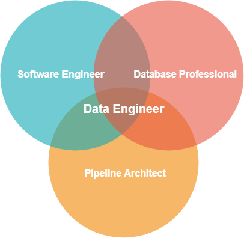
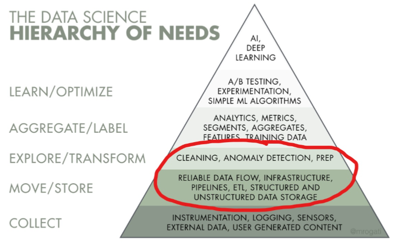

# Data Engineering
[//]:---
## What is a Data Engineer?
Data Engineering (DE) is a **role** the naturally emerges when an organization moves from a centralized database to distributed, heterogeneous data stores.

Data Engineering can be a response to different needs: 
- Data Warehousing/Data Lakes - focus may be more on ETL/Reporting
- Machine Learning - the DE role is adjacent to the Data Scientist role
- Distributed Cloud Architecture - data and events are spread across Cloud Storage and other systems.

[//]:---

## What are Data Pipelines?
Data Pipelines are created to process data in a distributed data environment. Data points are created by applications and processed through various stages of the pipeline to produce useful, meaningful data.

In a traditional centralized RDBMS environment, applications often write directly to a database and the RDBMS acts both as the storage engine and data processing tool.  A data pipeline spreads storage across different stores and processing is often done outside of the data store.
[//]:---

### Pipeline Example
- user events are ingested into the pipeline in real-time
- events are batch processed matching the raw events by vendor, user, product or some other meaningful feature
- data is organized, cleansed, analyzed and written other datastores, notifying subscribed applications of the new data
- data is queried through an API and used by ML, applications, etc.

This same data can be processed further or into new combinations.  The raw data to processed data is a one to many relationship.
[//]:---

## What is a Data Engineer?
The Data Engineer role involves preparing data for analytical or operational use.
[//]:---

## Skills
Data Engineering requires both technical skills and a deep understanding for the complexities surrounding data.  

[//]:---

## Knowledge Skills
- Data skills - understanding of relational and non-relational data.  
- Manipulating, importing, moving flat file data.  
- Cleaning, transforming normalizing, denormaling data.  
- Dealing with difficult data issues such as foreign language charactersets, etc.
- An understanding of Data Science and Machine Learning
- SDLC concepts

[//]:---

## Technical Skills
- Proficiency in at least one programming language 
- Software Engineering/SDLC (as opposed to just scripting)
- Linux skills
- Cloud skills
- Automation skills
- Monitoring skills
- Data visualization
- Design skills

[//]:---

## Specific Technical Skills (for our current environment)
- Python
- AWS
- Lambda
- Linux
- Pandas
- git
- advanced SQL or HiveSQL
- understanding of distributed data (NoSQL) concepts
- Jupyter notebooks

[//]:---

## Data Engineering for US
DE for us is both a response to cloud and ML.  

Our services run on cloud infrastructure and creates various events that require processing to convert these to meaningful statistics.  

These statistics will drive its ML recommendation engine.  

[//]:---

## Who makes a good DE?

- A software engineer with a strong data skills and an understanding and appreciation for the difficulty, risks and importance of data would make a good data engineer.

- A database professional willing to point their data skills outside of the RDBMS ecosystem and a desire to developer skills would make a great data engineer.

[//]:---

## Data Engineering and ML
The Data Scientist and Data Engineer should be best friends.

In many small organizations the DE role is handled by the Data Scientist.  As challenges become more complex and needs of both the DS and DE work grow, this becomes increasingly difficult.  The DE role should work closely with the DS and their goals should be in close alignment.

[//]:---

# Where can we find Data Engineers?
- We should start with our own database professionals.  
- As we move more workloads to the cloud, lower level DB management will be in less demand, but their strong data skills learned in the trenches will serve them well and outweigh the time it would take to learn new skills (such as programming).  
- Database professionals will find most of this work to be familiar once they start working in the role.

[//]:---

# Summary
Data Engineering has emerged in response to rapid changes in technology.  

The prevalence of decentralized data created by Cloud and needs of Machine Learning present new challenges.  

Data Engineers are a response to these changes.  They are pragmatic problem solvers with the skills and knowledge to build new solutions that span technological boundaries and capture the inherent value in raw data.

[//]:---

