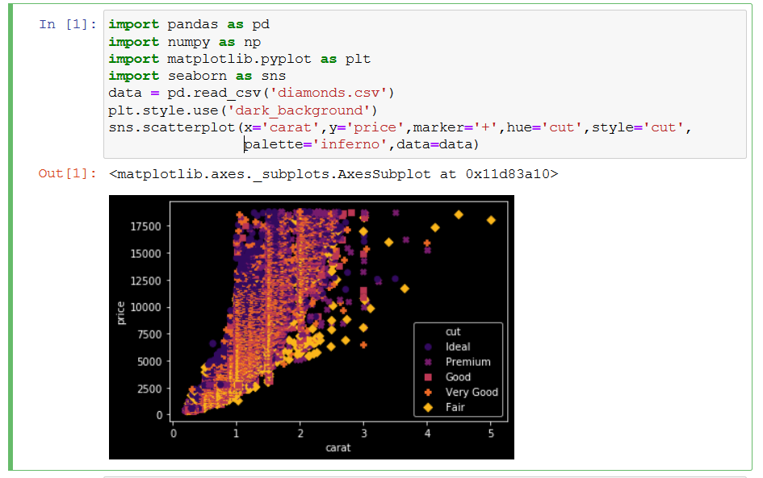

# Tips on getting started with Python

Below are some tips to start learning Python the right way, right from the start.

There is no shortage of *getting started* guides on the internet, but I believe that these steps below will set you on the best path to being productive.

# Setting up your environment

## Start with [Python3](https://www.python.org/downloads/release/latest)
- Python2 is [officially dead](https://pythonclock.org/).  You can use it in a virtualenv (see next tip) if you need it for some specific reason

## Use [Virtualenv](https://virtualenv.pypa.io/en/latest/) 

**virtualenv is a tool to create isolated Python environments** 


- use virtualenv right from the start (even if you don't yet understand why)
- it may seem confusing at first - its not, its easy
- keeps everything clean, you'll understand later, trust me
- makes your code easier to test
- makes migrating between laptops easier
- creates isolated Python environments
- addresses dependency and versioning of both python and packages
- you can run multiple versions of Python without problems

## Use [Jupyter](https://jupyter.org/) notebooks
**"A Jupyter Notebook is an open source web application that you can use to create and share documents that contain live code, equations, visualizations, and text.
"** [source](https://realpython.com/jupyter-notebook-introduction/)

see [Running Jupyter Notebooks on Windows](https://wiki.sabrenow.com/display/SPT/Running+Jupyter+Notebooks+on+Windows) to get started


- Jupyter will help with learning python and building solutions
- Run your notebooks in a Virtualenv (see earlier tip)
- Use Jupyter before even bothering with an IDE
- use them to:
	- try out new syntax
	- try out new packages
	- keep notes as you work on things
	- for data exploration
- benefits:
	- you can document as you go
	- variables contain state, data - which helps in debugging (and understanding)
	- great way to share, zip the notebook and data and email, upload to git, etc
- you can create beautiful data driven graphs with very little code
- 
- Easy to turn into documentation
- Great intro to [Markdown](https://www.markdownguide.org/getting-started/)

### Did you know? 
- Jupyter notebooks are helping [combat](https://www.ncbi.nlm.nih.gov/pmc/articles/PMC6988305/) the [Replication crisis in Science](https://en.wikipedia.org/wiki/Replication_crisis) 

	- **"A 2016 poll of 1,500 scientists reported that 70% of them had failed to reproduce at least one other scientist's experiment
(50% had failed to reproduce one of their own experiments)."** [crisis](https://en.wikipedia.org/wiki/Replication_crisis)

	- **"In 2009, 2% of scientists admitted to falsifying studies at least once and 14% admitted to personally knowing someone who did. Misconducts were reported more frequently by medical researchers than others."** [crisis](https://en.wikipedia.org/wiki/Replication_crisis)


## When you are ready for an IDE 

- Use [PyCharm](https://www.jetbrains.com/pycharm/)

	- Use Pycharm because thats what others on the team use (and it's great)
		- There are other great IDEs, but uniformity helps with code commits
		- PyCharm is a [jetbrains](https://www.jetbrains.com/) product and very similiar to [IntelliJ](https://www.jetbrains.com/idea/) which is the standard our Java developers use.  This simplifies for anyone moving between projects and helps us support each other when troubleshooting.
	- [Reformat](https://www.jetbrains.com/help/pycharm/reformat-file-dialog.html) with `Ctrl+Shift+Alt+L` - it takes a millisecond and makes your code look so much better.  It feels like cheating and it will teach you how to make things look better.

# Good Practices

## Don't `print()`, use a `logger`
- use a [logger](https://docs.python.org/3.8/library/logging.html) and log liberally
- logs will be captured when you operationalize your code and be very useful
- prints are confusing, lack timestamps
- steal this code below and paste it into your files: 
```
import logging

logging.basicConfig(format="%(asctime)s - %(thread)s - %(levelname)s - %(message)s")
logger = logging.getLogger()
logger.setLevel(logging.INFO)

logger.info('log something')

2020-02-21 09:17:21,229 - 5784 - INFO - log something
```
